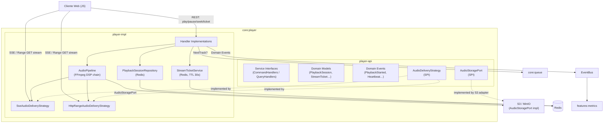
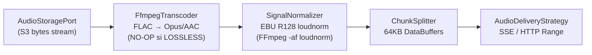
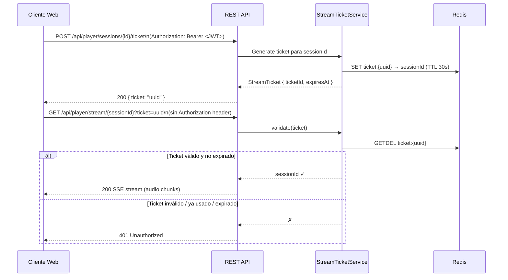
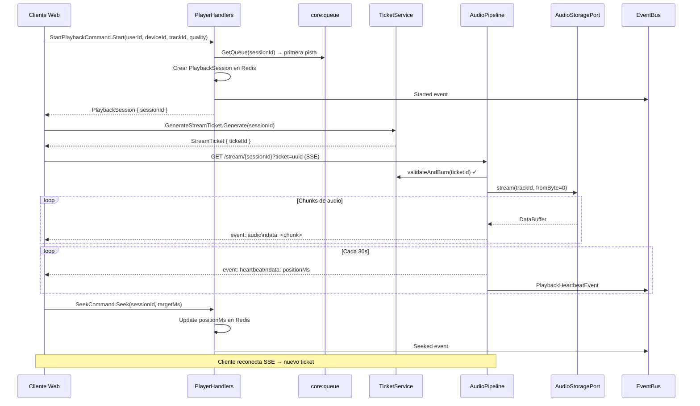
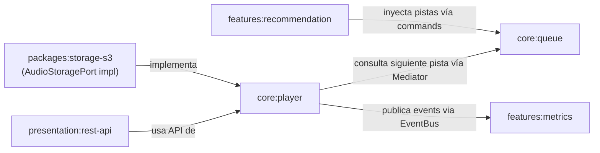

# `core:player` — Motor de Streaming de Audio

## 1. Visión General

`core:player` es el bounded context responsable de **entregar audio procesado al cliente web**. Gestiona el ciclo de vida de una sesión de reproducción desde que el usuario pulsa *play* hasta que para —incluyendo pausa, reanudación, seeking y salto de pista— y emite eventos de dominio para que otros módulos (principalmente `features:metrics`) reaccionen.

### Responsabilidades

| Responsabilidad | Descripción |
|---|---|
| Obtención del audio | Recupera el stream de bytes desde S3/MinIO a través de `AudioStoragePort` |
| Procesamiento DSP | Aplica transcoding, normalización EBU R128 y otros filtros via FFmpeg |
| Entrega al cliente | Sirve el stream via SSE (principal) o HTTP Range (coexistente) |
| Gestión de sesión | Mantiene `PlaybackSession` en Redis (posición, estado, calidad) |
| Autenticación de stream | Emite *One-Time Tickets* de corta duración para proteger el endpoint de streaming |
| Métricas | Publica eventos de dominio al `EventBus` (fire-and-forget) |

### Lo que **NO** hace

- **No gestiona la cola** → eso es `core:queue`
- **No agrega estadísticas** → eso es `features:metrics`
- **No decide la siguiente pista** → pregunta a `core:queue`

---

## 2. Arquitectura del Módulo



---

## 3. Módulos Gradle

```
core/player/
├── player-api/      # Interfaces, modelos, ports, eventos
└── player-impl/     # Implementaciones, pipeline, adapters
```

### `player-api/build.gradle`

```groovy
dependencies {
    implementation project(':core:shared')

    compileOnly 'org.springframework:spring-context'
    compileOnly 'io.projectreactor:reactor-core'
    compileOnly 'org.springframework.data:spring-data-commons'
    compileOnly 'org.springframework.core:spring-core' // DataBuffer
}
```

### `player-impl/build.gradle`

```groovy
dependencies {
    implementation project(':core:player:player-api')
    implementation project(':core:queue:queue-api')
    implementation project(':core:shared')

    implementation 'org.springframework:spring-context'
    implementation 'io.projectreactor:reactor-core'
    implementation 'org.springframework.data:spring-data-redis'
    implementation 'io.lettuce:lettuce-core'
    implementation 'org.springframework.core:spring-core'  // DataBuffer
}
```

---

## 4. Estructura de Paquetes

```
com.ggar.hibiki.core.player/
│
├── [player-api]
│   ├── model/
│   │   ├── PlaybackSession.java
│   │   ├── PlaybackState.java       (enum: PLAYING, PAUSED, BUFFERING, STOPPED)
│   │   ├── StreamQuality.java       (enum: LOSSLESS, HIGH, NORMAL)
│   │   ├── DeliveryMode.java        (enum: SSE, HTTP_RANGE)
│   │   └── StreamTicket.java
│   ├── port/
│   │   ├── AudioStoragePort.java    (SPI: obtener bytes desde el storage)
│   │   ├── AudioDeliveryStrategy.java (SPI: protocolo de entrega al cliente)
│   │   └── PlaybackSessionRepository.java
│   └── service/                     (Action-Based Handler interfaces)
│       ├── StartPlaybackCommandHandler.java
│       ├── PausePlaybackCommandHandler.java
│       ├── ResumePlaybackCommandHandler.java
│       ├── StopPlaybackCommandHandler.java
│       ├── SeekCommandHandler.java
│       ├── GenerateStreamTicketCommandHandler.java
│       └── GetPlaybackStateQueryHandler.java
│
└── [player-impl]
    └── infrastructure/
        ├── handler/
        │   ├── StartPlaybackCommandHandlerImpl.java
        │   ├── PausePlaybackCommandHandlerImpl.java
        │   ├── ResumePlaybackCommandHandlerImpl.java
        │   ├── StopPlaybackCommandHandlerImpl.java
        │   ├── SeekCommandHandlerImpl.java
        │   ├── GenerateStreamTicketCommandHandlerImpl.java
        │   └── GetPlaybackStateQueryHandlerImpl.java
        ├── persistence/
        │   ├── entity/PlaybackSessionEntity.java
        │   ├── mapper/PlaybackSessionMapper.java
        │   └── repository/RedisPlaybackSessionRepository.java
        ├── pipeline/
        │   ├── AudioPipeline.java
        │   ├── FfmpegTranscoder.java
        │   ├── SignalNormalizer.java
        │   └── ChunkSplitter.java
        ├── delivery/
        │   ├── SseAudioDeliveryStrategy.java
        │   └── HttpRangeDeliveryStrategy.java
        └── ticket/
            └── StreamTicketService.java
```

---

## 5. Modelos de Dominio

Siguiendo el patrón del proyecto, los **domain models** usan Value Objects para los identificadores; los **DTOs / nested records** usan tipos primitivos.

```java
// PlaybackSession — estado volátil en Redis
@Value
@FieldDefaults(level = AccessLevel.PRIVATE, makeFinal = true)
@NoArgsConstructor(force = true, access = AccessLevel.PRIVATE)
@AllArgsConstructor(staticName = "of")
@Builder(toBuilder = true)
public class PlaybackSession {
    /** Identificador único de la sesión de reproducción. */
    SessionId sessionId;
    /** Usuario propietario de la sesión. */
    UserId userId;
    /** Dispositivo desde el que se inició. */
    DeviceId deviceId;
    /** Pista que está sonando o en pausa. */
    TrackId currentTrackId;
    /** Marca temporal de reproducción en milisegundos. */
    long positionMs;
    /** Estado de la sesión. */
    PlaybackState state;
    /** Calidad de stream solicitada. */
    StreamQuality quality;
    /** Protocolo de entrega activo. */
    DeliveryMode deliveryMode;
    /** Momento en que se inició la sesión. */
    Instant startedAt;
}

// StreamTicket — token efímero de un solo uso para auth del stream SSE
@Value
@FieldDefaults(level = AccessLevel.PRIVATE, makeFinal = true)
@NoArgsConstructor(force = true, access = AccessLevel.PRIVATE)
@AllArgsConstructor(staticName = "of")
public class StreamTicket {
    /** UUID del ticket (incluido en la URL del stream). */
    UUID ticketId;
    /** Sesión a la que está vinculado. */
    SessionId sessionId;
    /** Momento de expiración (TTL ~30 segundos). */
    Instant expiresAt;
}
```

---

## 6. Handlers CQRS (Action-Based Nested Records)

El proyecto sigue el patrón **Action-Based Nested Records** definido en `rules/ACTION_BASED_HANDLERS.md`. El Command/Query se define como un `record` anidado dentro de la interfaz del handler.

### Commands

```java
/** Inicia una nueva sesión de reproducción para una pista. */
public interface StartPlaybackCommandHandler
        extends CommandHandler<StartPlaybackCommandHandler.Start, PlaybackSession> {

    /** Datos necesarios para arrancar la reproducción. */
    record Start(
            UUID userId,
            UUID deviceId,
            UUID trackId,
            StreamQuality quality,
            DeliveryMode preferredDelivery
    ) implements Command<PlaybackSession> {}

    /** Evento publicado en el EventBus cuando la sesión arranca. */
    record Started(
            UUID sessionId,
            UUID userId,
            UUID trackId,
            UUID deviceId,
            StreamQuality quality,
            Instant timestamp
    ) implements DomainEvent {}
}
```

```java
/** Pausa la reproducción activa guardando la posición actual. */
public interface PausePlaybackCommandHandler
        extends CommandHandler<PausePlaybackCommandHandler.Pause, PlaybackSession> {

    record Pause(UUID sessionId) implements Command<PlaybackSession> {}

    record Paused(UUID sessionId, UUID trackId, long positionMs, Instant timestamp)
            implements DomainEvent {}
}
```

```java
/** Reanuda la reproducción desde la posición guardada. */
public interface ResumePlaybackCommandHandler
        extends CommandHandler<ResumePlaybackCommandHandler.Resume, PlaybackSession> {

    record Resume(UUID sessionId) implements Command<PlaybackSession> {}

    record Resumed(UUID sessionId, UUID trackId, long positionMs, Instant timestamp)
            implements DomainEvent {}
}
```

```java
/** Detiene y destruye la sesión de reproducción. */
public interface StopPlaybackCommandHandler
        extends CommandHandler<StopPlaybackCommandHandler.Stop, Void> {

    record Stop(UUID sessionId) implements Command<Void> {}

    record Stopped(
            UUID sessionId,
            UUID userId,
            UUID trackId,
            long totalListenedMs,
            boolean completedFully,
            Instant timestamp
    ) implements DomainEvent {}
}
```

```java
/** Mueve la posición de reproducción a un punto específico en milisegundos. */
public interface SeekCommandHandler
        extends CommandHandler<SeekCommandHandler.Seek, PlaybackSession> {

    record Seek(UUID sessionId, long targetPositionMs) implements Command<PlaybackSession> {}

    record Seeked(UUID sessionId, UUID trackId, long fromMs, long toMs, Instant timestamp)
            implements DomainEvent {}
}
```

```java
/**
 * Genera un One-Time Ticket de corta duración (TTL ~30s) para autenticar
 * la conexión al stream SSE sin exponer el JWT en la URL persistente.
 */
public interface GenerateStreamTicketCommandHandler
        extends CommandHandler<GenerateStreamTicketCommandHandler.Generate, StreamTicket> {

    record Generate(UUID sessionId, UUID userId) implements Command<StreamTicket> {}
}
```

### Queries

```java
/** Retorna el estado actual de reproducción para un dispositivo concreto. */
public interface GetPlaybackStateQueryHandler
        extends QueryHandler<GetPlaybackStateQueryHandler.Get, PlaybackSession> {

    record Get(UUID userId, UUID deviceId) implements Query<PlaybackSession> {}
}
```

---

## 7. Ports (SPI)

```java
/**
 * Puerto de salida para obtener el stream binario de una pista desde el storage.
 * La implementación concreta (S3, local, MinIO) vive fuera de core:player.
 */
public interface AudioStoragePort {

    /**
     * Abre un stream reactivo de bytes para la pista indicada,
     * comenzando desde {@code fromByte} (para seeking o reanudación).
     *
     * @param trackId   Identificador de la pista
     * @param fromByte  Offset en bytes desde el que empezar (0 = inicio)
     * @return Flux de DataBuffers con el contenido de audio
     */
    Flux<DataBuffer> stream(TrackId trackId, long fromByte);

    /**
     * Retorna el tamaño total en bytes de la pista, necesario para
     * calcular el offset de seeking por tiempo y para los headers Range.
     */
    Mono<Long> sizeInBytes(TrackId trackId);
}
```

```java
/**
 * Puerto de entrega: abstrae el protocolo de transporte usado para
 * enviar los DataBuffers de audio al cliente.
 *
 * Implementaciones activas:
 * - SseAudioDeliveryStrategy  (primaria, text/event-stream)
 * - HttpRangeDeliveryStrategy (coexistente, Accept-Ranges: bytes)
 */
public interface AudioDeliveryStrategy {

    /** Identifica el tipo de transporte de esta estrategia. */
    DeliveryMode mode();

    /**
     * Toma el Flux de audio ya procesado y lo sirve al cliente
     * según el protocolo de esta estrategia.
     */
    Flux<DataBuffer> deliver(PlaybackSession session, Flux<DataBuffer> audioStream);
}
```

---

## 8. Pipeline de Audio (DSP)

El pipeline es una cadena de `Function<Flux<DataBuffer>, Flux<DataBuffer>>` compuesta en orden. Cada paso es independiente y activable por configuración.



### `FfmpegTranscoder`

Invoca FFmpeg como proceso externo con pipes de stdin/stdout:

```
ffmpeg -i pipe:0 -c:a libopus -b:a 320k -f ogg pipe:1
```

Solo se activa si `StreamQuality != LOSSLESS`. Para audio lossless, el stream pasa sin tocar.

### `SignalNormalizer`

```
ffmpeg -i pipe:0 -af loudnorm=I=-14:TP=-1:LRA=11 -f same_as_input pipe:1
```

Aplica normalización de volumen EBU R128 (el mismo estándar que Spotify/YouTube). Evita saltos bruscos de volumen entre pistas de distinto master.

### `ChunkSplitter`

Divide el stream continuo en `DataBuffer`s de tamaño fijo (configurable, por defecto 64KB). Esto garantiza chunks consistentes independientemente de cómo el proceso FFmpeg emita bytes.

---

## 9. Autenticación del Stream: One-Time Tickets

`EventSource` en JavaScript no permite añadir headers HTTP. En lugar de filtrar el JWT en la URL o usar cookies (problemas cross-origin), Hibiki emplea **tickets de un solo uso**:



El ticket se **quema atómicamente** (`GETDEL` en Redis) en el momento de validación — no puede reutilizarse aunque sea interceptado.

---

## 10. Estrategias de Entrega

### SSE (Primaria)

```
GET /api/player/stream/{sessionId}?ticket={uuid}
Accept: text/event-stream

→ HTTP 200
   Content-Type: text/event-stream

   event: audio
   data: <base64 chunk>

   event: heartbeat
   data: {"positionMs": 42000}

   event: end
   data: {"reason": "TRACK_COMPLETE"}
```

El canal SSE transporta tanto los **bytes de audio** como **señalización** (heartbeats de posición, notificaciones de pausa remota, fin de pista). El cliente JavaScript Buffer-ea los chunks y los alimenta a la Web Audio API.

### HTTP Range (Coexistente)

```
GET /api/player/stream/{sessionId}?ticket={uuid}
Range: bytes=0-65535

→ HTTP 206 Partial Content
   Content-Range: bytes 0-65535/14829056
   Accept-Ranges: bytes
   Content-Type: audio/ogg
```

Seleccionada automáticamente si el request lleva header `Range`. Compatible con el elemento `<audio>` nativo y con descargas parciales.

---

## 11. Domain Events emitidos al EventBus

Todos los eventos son `record`s anidados dentro de sus handlers y se publican via `SpringEventBus` de forma fire-and-forget.

| Evento | Cuándo | Campos clave |
|---|---|---|
| `StartPlaybackCommandHandler.Started` | Al crear sesión | `sessionId`, `userId`, `trackId`, `quality` |
| `PausePlaybackCommandHandler.Paused` | Al pausar | `sessionId`, `trackId`, `positionMs` |
| `ResumePlaybackCommandHandler.Resumed` | Al reanudar | `sessionId`, `trackId`, `positionMs` |
| `StopPlaybackCommandHandler.Stopped` | Al parar | `sessionId`, `totalListenedMs`, `completedFully` |
| `SeekCommandHandler.Seeked` | Al hacer seek | `sessionId`, `fromMs`, `toMs` |
| `PlaybackHeartbeatEvent` | Cada ~30s de stream activo | `sessionId`, `trackId`, `positionMs` |

> **Nota sobre el Heartbeat**: el servidor emite el heartbeat midiendo los bytes enviados (no depende del cliente JS). `features:metrics` lo usa para calcular el tiempo real de escucha.

---

## 12. Flujo Completo de Reproducción



---

## 13. Relaciones con Otros Módulos



| Módulo | Dependencia | Dirección |
|---|---|---|
| `core:queue:queue-api` | `player-impl` la usa | → player consulta la cola |
| `features:metrics` | suscribe events | player → metrics (EventBus) |
| `packages:storage-s3` | implementa `AudioStoragePort` | S3 adapter → player-api |
| `presentation:rest-api` | expone endpoints | presentation usa player-api |
