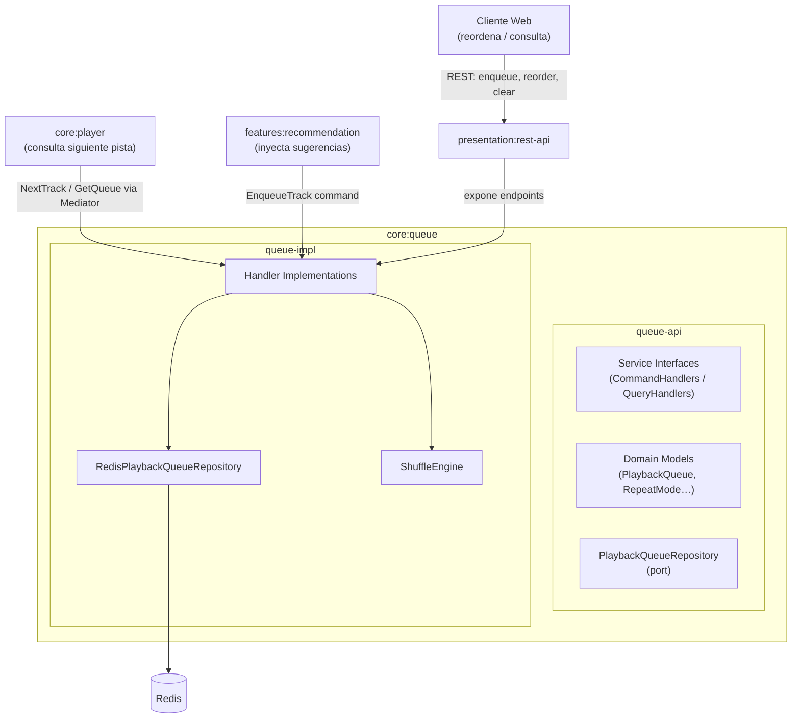
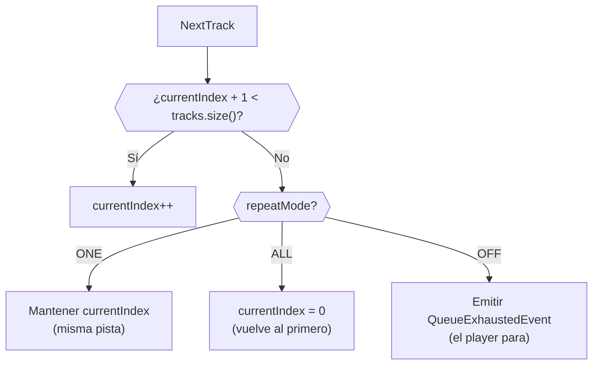
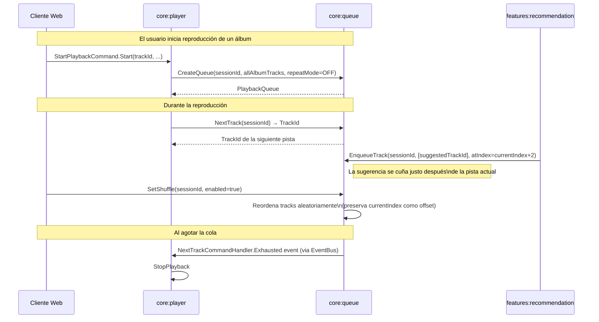
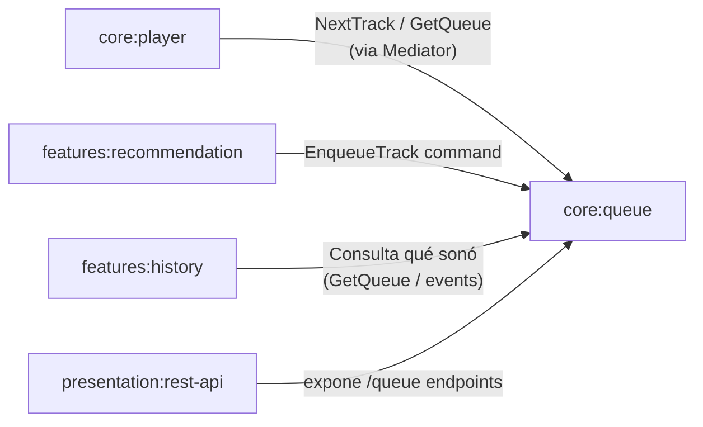

# `core:queue` — Gestión de Cola de Reproducción

## 1. Visión General

`core:queue` es el bounded context responsable de **mantener el estado de la cola de reproducción asociada a una sesión**. Sabe qué pistas van a continuación, cuál es la posición actual, si el shuffle está activado y cuál es la política de repetición.

### Por qué existe como módulo independiente

La separación respecto a `core:player` es deliberada y permite:

- **`features:recommendation`** inyectar pistas sugeridas directamente en la cola sin necesidad de conocer nada del streaming
- **`core:player`** preguntar "¿cuál es la siguiente pista?" de forma autónoma sin gestionar listas
- **Clientes web** reordenar, purgar o consultar la cola sin interrumpir el stream en curso
- Escalar o reimplementar la lógica de cola sin afectar al pipeline de audio

### Responsabilidades

| Responsabilidad | Descripción |
|---|---|
| Estado de la cola | Mantiene la lista ordenada de `TrackId`s y el cursor actual |
| Políticas de reproducción | Shuffle, Repeat (OFF / ONE / ALL) |
| Resolución de siguiente pista | Responde a `next/previous` respetando las políticas activas |
| Persistencia volátil | Estado en Redis. Si la sesión muere, la cola muere |

### Lo que **NO** hace

- **No inicia streams** → eso es `core:player`
- **No genera recomendaciones** → las recibe de `features:recommendation` via commands
- **No persiste historiales de escucha** → eso es `features:metrics` / `features:history`

---

## 2. Arquitectura del Módulo



---

## 3. Módulos Gradle

```
core/queue/
├── queue-api/      # Interfaces, modelos, port de repositorio
└── queue-impl/     # Implementaciones, persistencia Redis
```

### `queue-api/build.gradle`

```groovy
dependencies {
    implementation project(':core:shared')

    compileOnly 'org.springframework:spring-context'
    compileOnly 'io.projectreactor:reactor-core'
}
```

### `queue-impl/build.gradle`

```groovy
dependencies {
    implementation project(':core:queue:queue-api')
    implementation project(':core:shared')

    implementation 'org.springframework:spring-context'
    implementation 'io.projectreactor:reactor-core'
    implementation 'org.springframework.data:spring-data-redis'
    implementation 'io.lettuce:lettuce-core'
}
```

---

## 4. Estructura de Paquetes

```
com.ggar.hibiki.core.queue/
│
├── [queue-api]
│   ├── model/
│   │   ├── PlaybackQueue.java
│   │   └── RepeatMode.java         (enum: OFF, ONE, ALL)
│   ├── port/
│   │   └── PlaybackQueueRepository.java
│   └── service/                    (Action-Based Handler interfaces)
│       ├── CreateQueueCommandHandler.java
│       ├── EnqueueTrackCommandHandler.java
│       ├── DequeueTrackCommandHandler.java
│       ├── ClearQueueCommandHandler.java
│       ├── NextTrackCommandHandler.java
│       ├── PreviousTrackCommandHandler.java
│       ├── UpdateRepeatModeCommandHandler.java
│       ├── SetShuffleCommandHandler.java
│       └── GetQueueQueryHandler.java
│
└── [queue-impl]
    └── infrastructure/
        ├── handler/
        │   ├── CreateQueueCommandHandlerImpl.java
        │   ├── EnqueueTrackCommandHandlerImpl.java
        │   ├── DequeueTrackCommandHandlerImpl.java
        │   ├── ClearQueueCommandHandlerImpl.java
        │   ├── NextTrackCommandHandlerImpl.java
        │   ├── PreviousTrackCommandHandlerImpl.java
        │   ├── UpdateRepeatModeCommandHandlerImpl.java
        │   ├── SetShuffleCommandHandlerImpl.java
        │   └── GetQueueQueryHandlerImpl.java
        ├── persistence/
        │   ├── entity/PlaybackQueueEntity.java
        │   ├── mapper/PlaybackQueueMapper.java
        │   └── repository/RedisPlaybackQueueRepository.java
        └── shuffle/
            └── ShuffleEngine.java
```

---

## 5. Modelo de Dominio

```java
// PlaybackQueue — estado volátil en Redis, vinculado a una PlaybackSession
@Value
@FieldDefaults(level = AccessLevel.PRIVATE, makeFinal = true)
@NoArgsConstructor(force = true, access = AccessLevel.PRIVATE)
@AllArgsConstructor(staticName = "of")
@Builder(toBuilder = true)
public class PlaybackQueue {
    /** Identificador único de la cola. */
    QueueId queueId;
    /** Sesión de reproducción a la que pertenece esta cola. */
    SessionId sessionId;
    /**
     * Lista ordenada de pistas pendientes. El orden es la fuente de verdad
     * para la reproducción; shuffle reordena esta lista en memoria.
     */
    List<TrackId> tracks;
    /** Índice de la pista actualmente activa dentro de {@code tracks}. */
    int currentIndex;
    /** Política de repetición activa. */
    RepeatMode repeatMode;
    /** Si true, el orden de {@code tracks} ha sido aleatorizado. */
    boolean shuffled;
}
```

### Lógica de navegación



---

## 6. Handlers CQRS (Action-Based Nested Records)

### Commands

```java
/** Crea una nueva cola asociada a una sesión, opcionalmente con pistas iniciales. */
public interface CreateQueueCommandHandler
        extends CommandHandler<CreateQueueCommandHandler.Create, PlaybackQueue> {

    record Create(
            UUID sessionId,
            List<UUID> initialTracks,   // puede estar vacía
            RepeatMode repeatMode,
            boolean shuffle
    ) implements Command<PlaybackQueue> {}
}
```

```java
/** Añade una o más pistas al final de la cola (o en posición específica). */
public interface EnqueueTrackCommandHandler
        extends CommandHandler<EnqueueTrackCommandHandler.Enqueue, PlaybackQueue> {

    record Enqueue(
            UUID sessionId,
            List<UUID> trackIds,
            /** Si null, añade al final. Si se especifica, inserta en esa posición. */
            Integer atIndex
    ) implements Command<PlaybackQueue> {}
}
```

```java
/** Elimina una pista concreta de la cola por su posición. */
public interface DequeueTrackCommandHandler
        extends CommandHandler<DequeueTrackCommandHandler.Dequeue, PlaybackQueue> {

    record Dequeue(UUID sessionId, int index) implements Command<PlaybackQueue> {}
}
```

```java
/** Vacía completamente la cola (excepto la pista en reproducción activa). */
public interface ClearQueueCommandHandler
        extends CommandHandler<ClearQueueCommandHandler.Clear, Void> {

    record Clear(UUID sessionId) implements Command<Void> {}
}
```

```java
/**
 * Avanza al siguiente track según la política de reproducción activa.
 * Retorna el TrackId de la nueva pista activa (o vacío si la cola se agotó).
 */
public interface NextTrackCommandHandler
        extends CommandHandler<NextTrackCommandHandler.Next, Optional<TrackId>> {

    record Next(UUID sessionId) implements Command<Optional<TrackId>> {}

    /** Publicado cuando la cola no tiene más pistas y repeatMode = OFF. */
    record Exhausted(UUID sessionId, Instant timestamp) implements DomainEvent {}
}
```

```java
/** Retrocede a la pista anterior. Si está en la primera, no hace nada. */
public interface PreviousTrackCommandHandler
        extends CommandHandler<PreviousTrackCommandHandler.Previous, Optional<TrackId>> {

    record Previous(UUID sessionId) implements Command<Optional<TrackId>> {}
}
```

```java
/** Actualiza la política de repetición de la cola activa. */
public interface UpdateRepeatModeCommandHandler
        extends CommandHandler<UpdateRepeatModeCommandHandler.Update, PlaybackQueue> {

    record Update(UUID sessionId, RepeatMode repeatMode) implements Command<PlaybackQueue> {}
}
```

```java
/** Activa o desactiva el modo shuffle. Reordena la lista internamente. */
public interface SetShuffleCommandHandler
        extends CommandHandler<SetShuffleCommandHandler.SetShuffle, PlaybackQueue> {

    record SetShuffle(UUID sessionId, boolean enabled) implements Command<PlaybackQueue> {}
}
```

### Queries

```java
/** Retorna el estado completo de la cola para una sesión dada. */
public interface GetQueueQueryHandler
        extends QueryHandler<GetQueueQueryHandler.Get, PlaybackQueue> {

    record Get(UUID sessionId) implements Query<PlaybackQueue> {}
}
```

---

## 7. Port de Repositorio

```java
/**
 * Puerto de salida para persistencia de la cola de reproducción.
 * La implementación usa Redis con TTL vinculado al tiempo de vida de la sesión.
 */
public interface PlaybackQueueRepository {

    Mono<PlaybackQueue> findBySessionId(SessionId sessionId);

    Mono<PlaybackQueue> save(PlaybackQueue queue);

    Mono<Void> deleteBySessionId(SessionId sessionId);
}
```

---

## 8. Ciclo de Vida de la Cola



---

## 9. Relaciones con Otros Módulos



| Módulo | Tipo de relación | Dirección |
|---|---|---|
| `core:player` | Consulta / Command | player → queue (pide siguiente pista) |
| `features:recommendation` | Command | recommendation → queue (inserta sugerencias) |
| `features:history` | Event / Query | queue → history (qué pistas se escucharon) |
| `presentation:rest-api` | API exposure | presentation usa queue-api |
