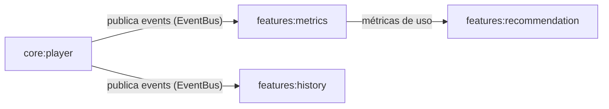
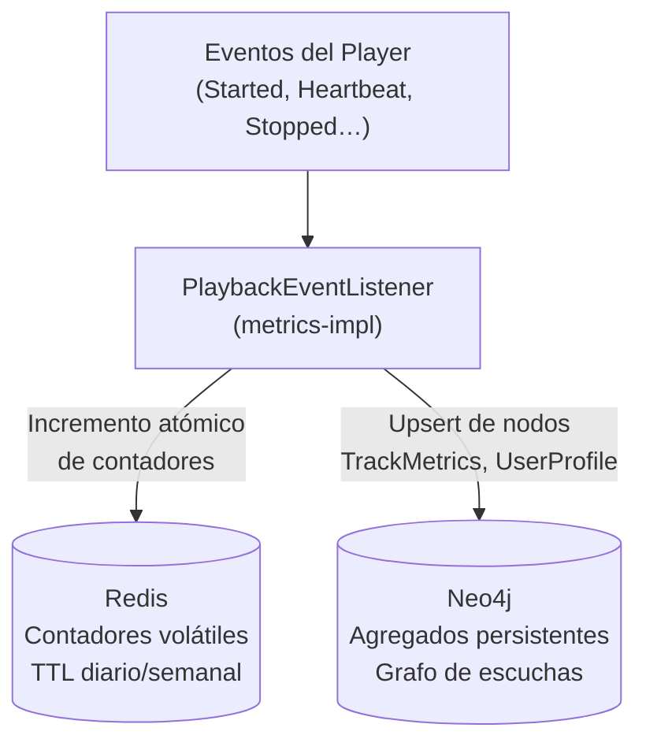
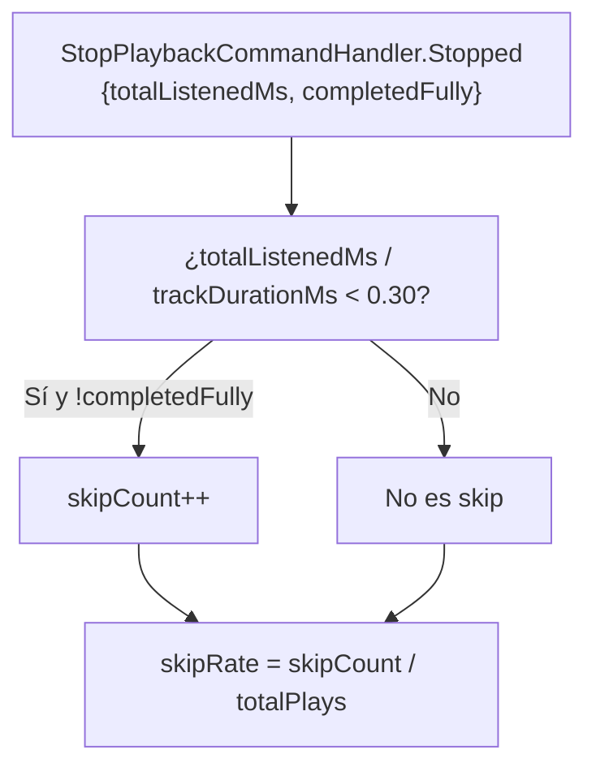
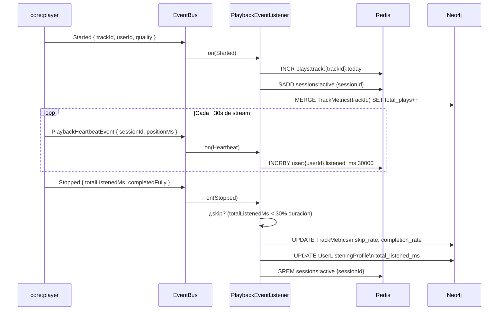
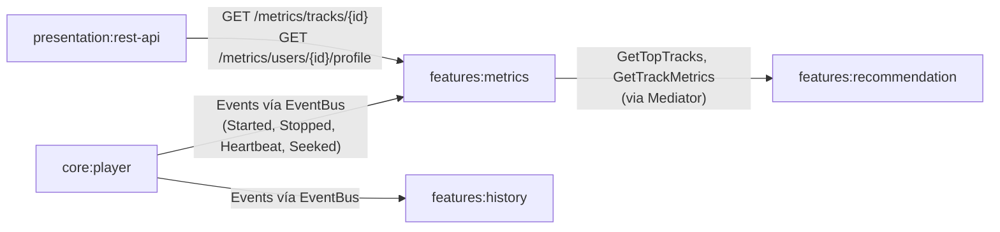

# `features:metrics` — Agregación y Análisis de Métricas de Escucha

## 1. Visión General

`features:metrics` es el bounded context responsable de **transformar eventos de reproducción en bruto en estadísticas de alto nivel significativas** para usuarios, artistas y el sistema en general.

A diferencia de otros módulos que actúan por comando o consulta, `features:metrics` es fundamentalmente **reactivo**: no expone casi ningún command, sino que escucha eventos del `EventBus` publicados por `core:player` y los condensa de forma asíncrona.

### Responsabilidades

| Responsabilidad | Descripción |
|---|---|
| Escucha de eventos | Suscribe todos los eventos de reproducción de `core:player` vía EventBus |
| Procesamiento en tiempo real | Contadores volátiles en Redis (sesiones activas, reproducciones del día) |
| Agregación persistente | Métricas calculadas almacenadas en Neo4j (skip rate, completion rate, listening time) |
| Exposición de métricas | Query handlers para que otros módulos consulten estadísticas |
| Cumplimiento GDPR | Command para purgar datos de escucha de un usuario |

### Lo que **NO** hace

- **No reproduce audio** → `core:player`
- **No genera recomendaciones** → `features:recommendation` consume las métricas que este módulo expone
- **No gestiona el historial de reproducción** → `features:history` se encarga del orden cronológico detallado

---

## 2. Relación con `core:player` (Dependencia Unidireccional)



`core:player` no conoce a `features:metrics`. La dependencia de compilación es únicamente en sentido contrario:

```
metrics-impl → core:player:player-api   (para conocer los tipos de evento)
metrics-impl → features:metrics:metrics-api
```

---

## 3. Estrategia de Almacenamiento (Dos Capas)

Las métricas tienen dos naturalezas distintas que requieren dos tipos de storage:



| Tipo de métrica | Storage | Por qué |
|---|---|---|
| Sesiones activas ahora | Redis (set) | Volátil, necesita TTL automático |
| Reproducciones del día | Redis (counter + TTL 24h) | Contador de alta frecuencia |
| Skip rate por track | Neo4j | Necesita histórico. Calculado sobre N eventos |
| Completion rate por track | Neo4j | ídem |
| Minutos escuchados por usuario | Neo4j | Persistente, vinculado al grafo de artistas |
| Top tracks por usuario | Neo4j | Consulta de grafo eficiente |

---

## 4. Módulos Gradle

```
features/metrics/
├── metrics-api/      # Modelos de métricas, query handler interfaces
└── metrics-impl/     # Listeners de eventos, agregadores, repositorios
```

### `metrics-api/build.gradle`

```groovy
plugins {
    id 'java-library'
}

dependencies {
    implementation project(':core:shared')

    compileOnly 'org.springframework:spring-context'
    compileOnly 'io.projectreactor:reactor-core'
}
```

### `metrics-impl/build.gradle`

```groovy
plugins {
    id 'java-library'
    id 'org.springframework.boot'
    id 'io.spring.dependency-management'
}

dependencies {
    implementation project(':features:metrics:metrics-api')
    implementation project(':core:player:player-api')   // para los tipos de evento
    implementation project(':core:shared')

    implementation 'org.springframework:spring-context'
    implementation 'io.projectreactor:reactor-core'
    implementation 'org.springframework.data:spring-data-neo4j'
    implementation 'org.springframework.data:spring-data-redis'
    implementation 'io.lettuce:lettuce-core'

    implementation "org.mapstruct:mapstruct:${rootProject.ext.versions.mapstruct}"
    annotationProcessor "org.mapstruct:mapstruct-processor:${rootProject.ext.versions.mapstruct}"
    annotationProcessor "org.projectlombok:lombok-mapstruct-binding:${rootProject.ext.versions.lombokMapstructBinding}"
}

bootJar { enabled = false }
jar     { enabled = true }
```

---

## 5. Estructura de Paquetes

```
com.ggar.hibiki.features.metrics/
│
├── [metrics-api]
│   ├── model/
│   │   ├── TrackMetrics.java           (estadísticas por pista)
│   │   ├── UserListeningProfile.java   (perfil de escucha de un usuario)
│   │   └── ListeningPeriod.java        (enum: DAILY, WEEKLY, MONTHLY, ALL_TIME)
│   ├── port/
│   │   ├── TrackMetricsRepository.java
│   │   └── UserListeningProfileRepository.java
│   └── service/
│       ├── GetTrackMetricsQueryHandler.java
│       ├── GetUserListeningProfileQueryHandler.java
│       ├── GetTopTracksQueryHandler.java
│       └── PurgeUserMetricsCommandHandler.java    (GDPR)
│
└── [metrics-impl]
    └── infrastructure/
        ├── listener/
        │   └── PlaybackEventListener.java         (suscribe todos los PlaybackXxxEvents)
        ├── aggregation/
        │   ├── ListeningTimeAggregator.java
        │   ├── SkipRateCalculator.java
        │   └── CompletionRateCalculator.java
        ├── handler/
        │   ├── GetTrackMetricsQueryHandlerImpl.java
        │   ├── GetUserListeningProfileQueryHandlerImpl.java
        │   ├── GetTopTracksQueryHandlerImpl.java
        │   └── PurgeUserMetricsCommandHandlerImpl.java
        └── persistence/
            ├── entity/
            │   ├── TrackMetricsNode.java          (@Node Neo4j)
            │   └── UserListeningProfileNode.java  (@Node Neo4j)
            ├── mapper/
            │   ├── TrackMetricsMapper.java
            │   └── UserListeningProfileMapper.java
            └── repository/
                ├── Neo4jTrackMetricsRepository.java
                └── Neo4jUserListeningProfileRepository.java
```

---

## 6. Modelos de Dominio

```java
// Métricas acumuladas por pista (nodo en Neo4j)
@Value
@FieldDefaults(level = AccessLevel.PRIVATE, makeFinal = true)
@NoArgsConstructor(force = true, access = AccessLevel.PRIVATE)
@AllArgsConstructor(staticName = "of")
@Builder(toBuilder = true)
public class TrackMetrics {
    /** Pista a la que pertenecen estas métricas. */
    TrackId trackId;
    /** Número total de veces que se ha iniciado la reproducción. */
    long totalPlays;
    /** Milisegundos totales escuchados a lo largo de toda la historia. */
    long totalListenedMs;
    /**
     * Porcentaje de reproducciones en las que el usuario no llegó al 30%
     * de la pista antes de parar o saltar. Rango: 0.0 – 1.0.
     */
    double skipRate;
    /**
     * Porcentaje de reproducciones en las que el usuario completó el 90%+
     * de la pista. Rango: 0.0 – 1.0.
     */
    double completionRate;
    /** Momento en que se calcularon por última vez estas métricas. */
    Instant lastUpdated;
}
```

```java
// Perfil de escucha de un usuario (nodo en Neo4j)
@Value
@FieldDefaults(level = AccessLevel.PRIVATE, makeFinal = true)
@NoArgsConstructor(force = true, access = AccessLevel.PRIVATE)
@AllArgsConstructor(staticName = "of")
@Builder(toBuilder = true)
public class UserListeningProfile {
    /** Usuario propietario del perfil. */
    UserId userId;
    /** Milisegundos totales escuchados (histórico completo). */
    long totalListenedMs;
    /** Pistas ordenadas por frecuencia de reproducción. */
    List<TrackId> topTracks;
    /** Momento de última actualización del perfil. */
    Instant lastUpdated;
}
```

---

## 7. Event Listener: el Corazón del Módulo

El `PlaybackEventListener` es el único punto de entrada de datos. Suscribe los eventos del `EventBus` de Spring de forma reactiva.

```java
@Component
public class PlaybackEventListener {

    private final ListeningTimeAggregator listeningTimeAggregator;
    private final SkipRateCalculator skipRateCalculator;
    private final CompletionRateCalculator completionRateCalculator;

    // SpringEventBus entrega estos eventos con @EventListener
    // La reactividad garantiza que no se bloquea el hilo del player

    @EventListener
    public Mono<Void> on(StartPlaybackCommandHandler.Started event) {
        // Incrementar contador de reproducciones del día en Redis
        // Actualizar total_plays en Neo4j (upsert)
        // Añadir sesión al set de sesiones activas en Redis
    }

    @EventListener
    public Mono<Void> on(PlaybackHeartbeatEvent event) {
        // Actualizar positionMs en Redis para la sesión activa
        // Acumular listening time en el perfil del usuario (Redis counter)
    }

    @EventListener
    public Mono<Void> on(StopPlaybackCommandHandler.Stopped event) {
        // Calcular si fue un skip (completedFully=false y totalListenedMs < 30% duración)
        // Actualizar skip_rate y completion_rate en Neo4j
        // Actualizar total_listened_ms en UserListeningProfile
        // Eliminar sesión del set de sesiones activas en Redis
    }

    @EventListener
    public Mono<Void> on(SeekCommandHandler.Seeked event) {
        // Registrar el seek (útil para análisis de engagement futuro)
        // No afecta a skip/completion rate directamente
    }
}
```

---

## 8. Lógica de Agregación

### Skip Rate

Una reproducción **cuenta como skip** si `completedFully = false` y el porcentaje escuchado es < 30% de la duración total de la pista.

```
skipRate = skips / totalPlays
```

Se actualiza incrementalmente en cada `StopPlaybackCommandHandler.Stopped`:



### Completion Rate

Una reproducción **cuenta como completada** si `completedFully = true` (flag que el pipeline del player activa cuando se alcanza el ≥90% del stream).

```
completionRate = completions / totalPlays
```

### Listening Time por Usuario

El `PlaybackHeartbeatEvent` llega cada ~30 segundos desde el servidor. Cada heartbeat añade `~30.000 ms` al contador del usuario en Redis. Cuando el `StopPlaybackCommandHandler.Stopped` llega, el valor final (`totalListenedMs`) del evento reemplaza el acumulado provisional de Redis y se persiste en Neo4j.

---

## 9. Query Handlers

```java
/** Retorna las métricas acumuladas de una pista concreta. */
public interface GetTrackMetricsQueryHandler
        extends QueryHandler<GetTrackMetricsQueryHandler.Get, TrackMetrics> {

    record Get(UUID trackId) implements Query<TrackMetrics> {}
}
```

```java
/** Retorna el perfil de escucha de un usuario para un período dado. */
public interface GetUserListeningProfileQueryHandler
        extends QueryHandler<GetUserListeningProfileQueryHandler.Get, UserListeningProfile> {

    record Get(UUID userId, ListeningPeriod period) implements Query<UserListeningProfile> {}
}
```

```java
/** Retorna las N pistas más reproducidas globalmente o por usuario en un período. */
public interface GetTopTracksQueryHandler
        extends QueryHandler<GetTopTracksQueryHandler.Get, List<TrackMetrics>> {

    record Get(
            /** Si null, retorna el top global. Si presente, top de ese usuario. */
            UUID userId,
            ListeningPeriod period,
            int limit
    ) implements Query<List<TrackMetrics>> {}
}
```

```java
/**
 * Elimina todos los datos de escucha de un usuario.
 * Requerido por la normativa GDPR / "derecho al olvido".
 */
public interface PurgeUserMetricsCommandHandler
        extends CommandHandler<PurgeUserMetricsCommandHandler.Purge, Void> {

    record Purge(UUID userId) implements Command<Void> {}

    record Purged(UUID userId, Instant timestamp) implements DomainEvent {}
}
```

---

## 10. Flujo Completo de una Reproducción y sus Métricas



---

## 11. Relaciones con Otros Módulos



| Módulo | Tipo de relación | Dirección |
|---|---|---|
| `core:player:player-api` | Dependencia de compilación | metrics-impl → player-api (eventos) |
| `features:recommendation` | Query (via Mediator) | recommendation → metrics-api |
| `presentation:rest-api` | Exposición API | presentation → metrics-api |
| `features:history` | Hermano independiente | comparten eventos del player, no se conocen entre sí |

> **Nota sobre `features:history`**: El historial cronológico de lo que un usuario escuchó ("escuchaste 'Kind of Blue' hace 3 días") es responsabilidad de `features:history`, **no** de `features:metrics`. Metrics se ocupa de agregados estadísticos, History de la línea de tiempo.
